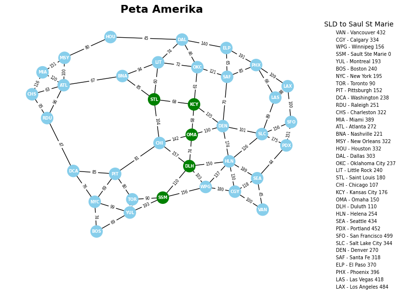

# Iterative Deepening A* (IDA*) Algorithm Implementation



This repository contains a Python implementation of the **Iterative Deepening A* (IDA*)** algorithm to find the shortest path between cities. This project demonstrates how IDA* operates efficiently by managing memory usage while still guaranteeing an optimal solution.

## 📋 About the Algorithm
IDA* (Iterative Deepening A*) is a graph traversal and pathfinding algorithm that combines the memory efficiency of **Depth-First Search (DFS)** with the optimality of **A* search**.

**Key Characteristics:**
- **Heuristic Function ($f(n) = g(n) + h(n)$):** Estimates the total cost from the start node to the goal.
- **Thresholding:** Unlike A*, IDA* uses a cost threshold to limit DFS exploration. If no solution is found, the threshold is increased to the minimum cost that exceeded the previous limit.
- **Memory Efficiency:** It is far more memory-efficient than A* because it does not store all visited nodes in memory.

## 📍 Case Study: STL to SSM Route
In this implementation, the program calculates the optimal path from **Saint Louis (STL)** to **Sault Ste. Marie (SSM)**.

**Search Results:**
- **Path:** `STL -> KCY -> OMA -> DLH -> SSM`
- **Total Cost:** 320

## 🚀 Main Features
- **Pure IDA* Implementation:** Recursive function logic with dynamic thresholding.
- **Graph Visualization:** Built with `NetworkX` and `Matplotlib` to display city connectivity and edge weights.
- **Path Highlighting:** The nodes and edges forming the final optimal path are highlighted in **Green** for easy identification.

## 🛠️ Environment Setup
1. Ensure you have Python 3.x installed.
2. Install the required libraries:
   ```bash
   pip install networkx matplotlib numpy

Credit :
1. [@Jetluck](https://github.com/r6rap) - Algoritma IDA*
2. [@Raku](https://github.com/RakuToukan) - Dokumentasi & Visualisasi Graf
